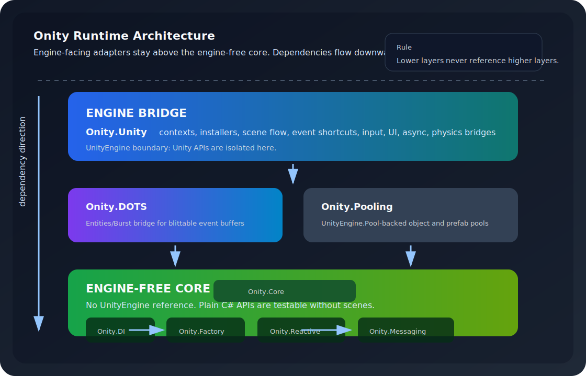

# Architecture Review

Clean-OOP / SOLID architecture review of the Onity framework, conducted against
`docs/Plan/01-Architecture.md` (module table, dependency rules, engine-ref
policy, public-API rules), `docs/Plan/07-Competitive-And-AI-Roadmap.md`, the
shipped asmdefs and public types under `Assets/Onity-Packages/Onity/Runtime/`,
and `docs/Onity-AI-Usage-Guide.md`.

Scope: the single `Onity` package (DI + Reactive + Events, plus the engine
bridge and pooling layers). Reviewer lens: clean OOP, SOLID, dependency
boundaries, public-vs-internal discipline, testability. No code was changed.

**Verdict: PASS (with minor concerns).** The layering, dependency direction,
and engine-free-core discipline are clean and enforced by the asmdef graph.
Concerns are limited to documentation drift, one contained internal duplication,
and small consistency nits — none of which warrant a structural refactor that
would risk the green test suite.

---

## 1. Layer and dependency model

### 1.1 Architecture diagram (as built)

Dependencies flow strictly downward. No lower layer references a higher one.

### 1.2 Verified dependency edges (from asmdef references)

| Module | `references` (asmdef) |
|---|---|
| `Onity.Core` | (none) |
| `Onity.Factory` | Core |
| `Onity.DI` | Core, Factory |
| `Onity.Reactive` | Core |
| `Onity.Messaging` | Core |
| `Onity.Pooling` | Core, Factory |
| `Onity.DOTS` | Core, Messaging (+ Unity ECS asmdefs) |
| `Onity.Unity` | Core, DI, DOTS, Factory, Messaging, Reactive, Pooling (+ Unity asmdefs) |

The documented `Onity.Async` module is **not yet a separate asmdef**; async
code currently lives inside `Onity.Unity/Scripts/Async`. This is a
*documented future extraction* (`01-Architecture.md` marks `Onity.Async` "NEW /
To extract"), not a violation. The Reactive/Messaging modules each depend only
on `Onity.Core`, exactly as specified, so the eventual `Onity.Async` extraction
will not invert any existing edge.

**Finding A1 (PASS):** Every runtime asmdef edge follows the documented
dependency rules with zero exceptions. The dependency direction is acyclic and
downward-only, enforced mechanically by Unity's asmdef resolver rather than by
convention.

### 1.3 Engine-free-core enforcement (measured, not asserted)

| Module | `noEngineReferences` | `using UnityEngine` count in module |
|---|---|---|
| `Onity.Core` | `true` | 0 |
| `Onity.Factory` | `true` | 0 |
| `Onity.DI` | `true` | 0 |
| `Onity.Reactive` | `true` | 0 |
| `Onity.Messaging` | `true` | 0 |
| `Onity.Pooling` | `false` | uses `UnityEngine.Pool` (intentional) |
| `Onity.Unity` | `false` | engine bridge (intentional) |
| `Onity.DOTS` | `false` | Entities/Burst (intentional) |

A direct content scan of the three headline core modules (`DI`, `Reactive`,
`Messaging`) found **zero** `using UnityEngine` directives, and a scan of the
entire `Runtime` tree found **zero** `using System.Linq` directives. Both
constraints from the AI usage guide ("engine-free core", "no `System.Linq`")
hold in the shipped source, not just in policy text.

**Finding A2 (PASS, notable strength):** The engine-free boundary is real and
verifiable. The four core pillars can be unit-tested with
`new OnityContainer()` / `new MessageBroker()` / `new Subject<T>()` in plain
EditMode with no scene — a genuine differentiator over Zenject and a cleaner
test surface than VContainer.

---

## 2. Module responsibilities and public surface

Each module maps to one cohesive responsibility, satisfying the
Single-Responsibility Principle at the *module* granularity.

| Module | Responsibility (one line) | Engine-free? | Primary public surface |
|---|---|---|---|
| `Onity.Core` | Shared primitives every pillar needs | Yes | `Unit`, `Lifetime`, `DisposableAction` |
| `Onity.Factory` | Runtime-argument construction contracts | Yes | `IFactory<TValue>` (+1, +2 param) |
| `Onity.DI` | Binding, resolution, member injection, build | Yes | `OnityContainer`, `IResolver`, `TypeBindingBuilder<T>`, `MultiTypeBindingBuilder`, `InjectAttribute`, two exception types, diagnostics structs |
| `Onity.Reactive` | Push-based observable algebra + operators | Yes | `IOnityObservable<T>`, `Subject<T>`, `ReactiveProperty<T>`, `CompositeDisposable`, operator extensions, `OnityObservableExceptionHandler`, `OnityReactiveException` |
| `Onity.Messaging` | Typed pub/sub broker + channels | Yes | `IMessageBroker`, `IPublisher<T>`/`ISubscriber<T>`, `MessageBroker`, `MessageChannel<T>`, keyed + async channels, `OnityMessagingException` |
| `Onity.Pooling` | Object/component pooling + diagnostics | No | `IPool<T>`, `OnityObjectPool`, `PrefabComponentPool` |
| `Onity.DOTS` | Managed -> ECS bridge queues | No | `OnityDots*` bridge types |
| `Onity.Unity` | Engine glue: contexts, installers, reactive/async/UI/scene-flow/input bridges | No | `OnityContext` family, `MonoInstaller`, `OnityEventHub`, `OnityUnityObservable`, lifetime extensions |

### 2.1 Public-vs-internal discipline

Measured across `Runtime/**/*.cs`: **125 public** type declarations vs
**21 internal** type declarations. The internal types cluster exactly where the
public-API rule wants them:

- **DI internals** live in a dedicated `Onity.DI.Internal` namespace under
  `Scripts/Internal/`: `ActivatorCompiler`, `MemberSetterCompiler`,
  `BakedGraph`, `TypeIdRegistry`. The performance machinery (compiled
  activators, compiled member setters, the baked-graph slot path) is fully
  hidden — a consumer sees only `OnityContainer` and the fluent builders.
- **Reactive internals**: `IOnityObservableV2<T>`, `OnityObservableV2<T>`,
  `OnityObservableAdapters` (`ToV2`/`ToLegacy`), and the v2 core operator
  extensions are all `internal`. Authored gameplay code references only the
  single public `IOnityObservable<T>`.

**Finding B1 (PASS, notable strength):** The public surface is intentionally
small and the "everything else is internal" rule is followed. The most
performance-sensitive and most-likely-to-change code (DI activator/baked
machinery, the v2 observable bridge) is correctly sealed behind `internal`,
which both protects consumers from churn and keeps the AI-facing surface
exactly the one documented in `Onity-AI-Usage-Guide.md` section 7.

**Finding B2 (CONCERN — internal duplication, contained):** The async/time
reactive operators (`Debounce`, `ThrottleLast`, `TakeUntil`, `SelectAwait`,
`WhereAwait`, `FirstAsync`) are authored against the internal
`IOnityObservableV2<T>` and re-exposed through public wrappers that return
`IOnityObservable<T>` (verified: `OnityObservableAsyncExtensions.cs` public
methods return `IOnityObservable<T>`; the v2 core lives in the internal
`OnityObservableAsyncCoreExtensions`). This is precisely the roadmap's P0-3
item: the *public* surface is already single (good), but two observer
abstractions and a `ToV2`/`ToLegacy` bridge are maintained internally. This is a
maintenance hazard, **not** a public-API or layering defect. It is safe to
defer; collapsing it is the roadmap's planned Phase B work and should be done as
its own change with the suite green before and after.

---

## 3. Clean-OOP / SOLID assessment of the three pillars

### 3.1 Single Responsibility (SRP)

- **DI:** `OnityContainer` owns binding + resolution + injection + build, which
  is a deliberately cohesive container responsibility (the same shape Zenject's
  `DiContainer` and VContainer's resolver take). It correctly delegates
  cross-cutting concerns outward: construction to `ActivatorCompiler`, member
  injection to `MemberSetterCompiler`, the fast path to `BakedGraph`,
  runtime-arg construction to `IFactory<...>`. The fluent builders
  (`TypeBindingBuilder<T>`, `MultiTypeBindingBuilder`) are separate small types,
  not methods bolted onto the container. Good separation for a container of this
  scope.
- **Reactive:** `Subject<T>` (multicast source), `ReactiveProperty<T>` (stateful
  value), and the operator extension classes are each one job. Operators added
  in `Scripts/Operators/` (`Scan`, `Pairwise`, `Merge`, `CombineLatest`,
  `Sample`) are one-file-per-operator — clean and discoverable.
- **Messaging:** `MessageChannel<T>` is one channel; `MessageBroker` is the
  channel registry; `KeyedMessageChannel<TKey,TMessage>` *reuses* the inner
  `MessageChannel<TMessage>` per key rather than reimplementing the swap-back
  removal (verified in source). That reuse is textbook SRP + DRY.

### 3.2 Dependency Inversion (DIP) and direction

- Consumers depend on abstractions: `IResolver`, `IFactory<...>`,
  `IPublisher<T>`/`ISubscriber<T>`, `IMessageBroker`, `IOnityObservable<T>`,
  `IReadOnlyReactiveProperty<T>`, `IPool<T>`. Concrete types
  (`OnityContainer`, `MessageBroker`, `Subject<T>`) implement these and are only
  needed at composition/wiring time.
- The container self-resolves `IResolver`/`OnityContainer`, so a factory can
  depend on the `IResolver` abstraction for lazy resolves rather than on a
  concrete container — the documented escape hatch for cycles.
- Dependency direction is enforced structurally (section 1.2): abstractions
  live in low layers, engine concretions live in `Onity.Unity`.

### 3.3 Open/Closed (OCP)

- Reactive is extended by adding operator extension methods over
  `IOnityObservable<T>` without modifying the core types — the operator catalog
  grew (Scan/Pairwise/Merge/CombineLatest/Sample) with no change to
  `Subject<T>`.
- Messaging gained keyed and async channels (`KeyedMessageChannel`,
  `AsyncMessageChannel`, `IAsyncPublisher`/`IAsyncSubscriber`,
  `IKeyedPublisher`/`IKeyedSubscriber`) as *new* types beside the existing
  `MessageChannel<T>`, not by mutating it.

### 3.4 Liskov / Interface Segregation

- Interfaces are narrow and role-segregated: publish vs subscribe are split
  (`IPublisher<T>` / `ISubscriber<T>`), read-only reactive state is a separate
  contract (`IReadOnlyReactiveProperty<T>`), and the factory arity variants are
  distinct interfaces. No "fat" interface forces a consumer to depend on methods
  it does not use.

### 3.5 Testability (evidence)

The engine-free core plus narrow interfaces make the pillars unit-testable
without a scene. Evidence: the EditMode suite under
`Tests/EditMode/Scripts` currently carries **363** `[Test]`/`[TestCase]`
attributes (counted in source), including dedicated Zenject/VContainer parity
suites and a `OnityBakedContainerTests` parity suite that asserts identical
results under both `UseBakedResolve` values. The "203 green" figure in the
project brief is a prior snapshot; the suite has since grown substantially,
which strengthens — not weakens — the testability evidence. The container even
exposes an `internal UseBakedResolve` toggle *specifically* so the parity tests
can prove the optimized path is behavior-identical to the reflection path. That
is a deliberate design-for-testability choice.

**Finding C1 (PASS, notable strength):** All five SOLID dimensions hold at the
module and type level. The pillars extend by addition, depend on abstractions,
and are provably testable in isolation.

---

## 4. Concerns and prioritized, safe improvements

Ordered by leverage. **All are documentation / cosmetic / contained-internal
items.** None require touching the resolve/publish/emit hot paths or the public
contracts, so none endanger the green suite.

| # | Priority | Concern | Concrete, safe action |
|---|---|---|---|
| 1 | High | **Doc drift: shipped surface exceeds the docs.** Source now ships `OnityReactiveException`, `OnityMessagingException`, `OnityObservableExceptionHandler`, `KeyedMessageChannel`/`IKeyed*`, `AsyncMessageChannel`/`IAsync*`, and `MemberSetterCompiler`. The AI usage guide (section 8) still says reactive/messaging "do not ship dedicated exception types yet" and "no keyed/async messaging". An AI loading the guide as ground truth will under-use real, shipped API. | Update `Onity-AI-Usage-Guide.md` sections 4 and 8 (and the per-module index in section 7) to list the now-shipped exception types, keyed messaging, and async handlers. Pure doc edit. |
| 2 | High | **Stale frozen test-count claims.** Project docs previously froze one historical full-suite count while the suite continued to grow. | Reference the live Test Runner/CI result for current status; keep exact counts only when clearly labeled as historical evidence. Doc only. |
| 3 | Medium | **Internal v2 observable duplication (B2).** Two observer abstractions + `ToV2`/`ToLegacy` maintained internally; async operators authored on v2. | Track as the roadmap's Phase B / P0-3 collapse. Do it as an isolated change, suite green before/after. Do **not** bundle with other work. No public-API impact when done. |
| 4 | Medium | **`Onity.Async` documented but not extracted.** Async code sits in `Onity.Unity/Scripts/Async`; the module table lists `Onity.Async` as a core engine-free module. | Either extract `Onity.Async` (Core + Reactive deps, as the doc specifies) in a dedicated change, or annotate the module table that the extraction is deferred. Low risk since no edge inverts. |
| 5 | Low | **Test asmdef is still a single umbrella.** `Onity.Tests.EditMode` is one assembly; `01-Architecture.md` calls for a per-module split in "Phase 0". | Leave as-is until the split is actually scheduled; note in the architecture doc that the umbrella is the current intentional state to avoid implying a gap. Doc/structure only. |
| 6 | Low | **XML-doc consistency on newer types.** Core types are well-documented; spot-check confirms operators and the keyed/async messaging types carry `///` docs. Worth a consistency pass for `<see>` cross-links and uniform "subscribe/dispose" phrasing (roadmap P2-2). | Cosmetic doc pass; no behavior change. |
| 7 | Low | **`OnityObservableExceptionHandler` is mutable public static.** It is a documented opt-in diagnostic hook (the architecture rule explicitly permits "diagnostic counter or documented opt-in", citing `DiagnosticsCollectionEnabled`). Acceptable, but it is process-global state. | Keep; ensure its XML doc states the global/process-wide scope so an AI does not treat it as per-scope. Already largely documented. Doc only. |

---

## 5. What is already strong (affirmations)

These are deliberate, working design strengths and should be preserved as-is:

1. **Mechanically enforced layering.** The dependency rules in
   `01-Architecture.md` are not aspirational — they are the literal asmdef
   `references` graph, acyclic and downward-only, verified edge-by-edge
   (section 1.2). A PR that breaks a boundary fails to compile.
2. **Real engine-free core.** Zero `UnityEngine` usings in DI/Reactive/Messaging
   and zero `System.Linq` anywhere in Runtime, both verified by content scan.
   This is the load-bearing differentiator behind "testable without a scene".
3. **Disciplined encapsulation.** 125 public vs 21 internal types, with the
   volatile performance machinery (DI activator/baked/setter compilers, the v2
   observable bridge) sealed behind `internal` and `Onity.DI.Internal`. The
   public surface stays aligned with the documented AI guide surface.
4. **One coherent mental model across pillars.** `broker.Observe<T>()` returns
   the same `IOnityObservable<T>` as `Subject<T>`/`ReactiveProperty<T>`; every
   `Subscribe` returns `IDisposable` disposed via one `AddTo(...)` family;
   `MessageBroker` + `OnityEventHub` auto-bind per scope. This is the genuine
   cross-cutting advantage over three separate libraries.
5. **SOLID-respecting extension model.** New reactive operators and new
   messaging capabilities (keyed, async) arrived as additive types, not as
   edits to the hot-path core — OCP in practice, and the reason the suite stays
   green as the surface grows.
6. **Design-for-testability baked in.** The `internal UseBakedResolve` parity
   toggle exists purely so tests can prove the optimized path equals the
   reflection path. A growing parity-test suite (Zenject, VContainer, baked) is
   the safety net that makes the "PASS, defer risky refactors" verdict credible.

---

## 6. Verdict

**PASS (minor concerns).** Onity's architecture is clean, cohesive, and
boundary-correct: a downward-only dependency graph enforced by asmdefs, a
genuinely engine-free core, a small well-encapsulated public surface, and SOLID
respected at both module and type granularity. The open items are documentation
drift (the docs trail the shipped surface), one contained internal v2-observable
duplication, and small structural/cosmetic nits — every one safe to address
incrementally without touching public contracts or hot paths, and therefore
without risking the green EditMode suite. No structural refactor is recommended.
